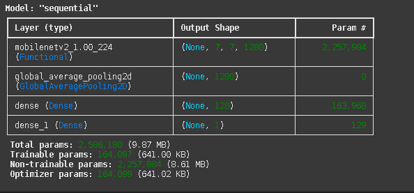
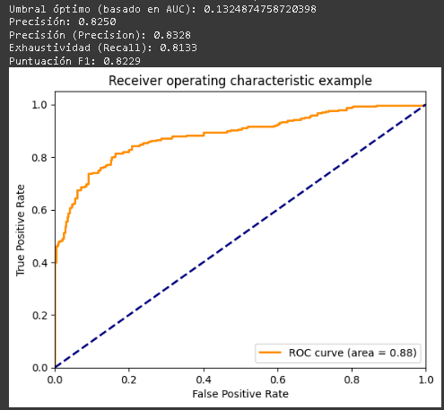

#  Clasificación de Cerdos - Modelo Base (v2)

## Introducción
Este proyecto consiste en el desarrollo de un modelo de clasificación binaria para detectar si una imagen pertenece a un "cerdo" o "no cerdo". El objetivo principal es entrenar y evaluar un modelo base que sirva como referencia para futuros fine-tuning y mejoras.

---

## Dataset Utilizado

- **Entrenamiento:**  
  - Carpeta `Train/` con 6200 imágenes (balanceadas entre dos clases: cerdo / no cerdo).
  
- **Validación:**  
  - Carpeta `Validation/` con 600 imágenes (300 cerdo y 300 no cerdo), etiquetadas explícitamente en el nombre de archivo.  
  *(Este dataset se utilizó únicamente para evaluación final, sin formar parte del entrenamiento.)*

---

## Configuración del Entorno

- Plataforma: Google Colab
- Framework: TensorFlow / Keras
- Formato de modelo guardado: `.keras` (se realizó también una copia en `.h5`)

---

## Proceso de Entrenamiento

1. **Montaje de Google Drive** para acceso al dataset.
2. **Carga de imágenes** con `ImageDataGenerator`, normalización (rescale=1/255).
3. **Arquitectura utilizada:**  
   - **Base:** MobileNetV2 (`weights=imagenet`, `include_top=False`)
   - **Congelamiento de capas base:** Sí (training freeze).
   - **Capas añadidas:**  
     - `GlobalAveragePooling2D`
     - `Dense(128, activation='relu')`
     - `Dense(1, activation='sigmoid')`
4. **Compilación del modelo:**  
   - Optimizador: Adam (default learning rate)
   - Función de pérdida: `binary_crossentropy`
   - Métricas: `accuracy`
5. **Entrenamiento:**  
   - Épocas: 10
   - Batch Size: 32
6. **Guardado del modelo final:**  
   - Exportado a Google Drive como `chanchitos_model.keras`.

---

### Datos del Modelo

---

## Evaluación del Modelo Base (v2)

**Resultados generales sobre el dataset `Validation/`:**

- **Umbral óptimo (basado en AUC):** 0.1325
- **Precisión general (Accuracy):** 0.8250
- **Precision:** 0.8328
- **Recall (Exhaustividad):** 0.8133
- **F1-Score:** 0.8229
- **AUC-ROC:** 0.88

---

### Resultados Generales

---

### Datos Generales

---

### Matriz de Confusión

(Se muestra la clasificación de todo el conjunto de validación)

|                      | Predijo Cerdo | Predijo No Cerdo |
|----------------------|---------------|-----------------|
| **Real Cerdo**        | 293           | 7               |
| **Real No Cerdo**     | 80            | 220             |

---

### Matriz de Confusión

(Gráfico adicional analizando los errores de baja y alta confianza de las predicciones)

---

## Análisis de Resultados

- El modelo mostró un rendimiento sólido en la clasificación general.
- Se identificaron imágenes de **baja confianza** (outputs cercanos al umbral óptimo) que fueron analizadas.
- La arquitectura MobileNetV2 congelada permitió un entrenamiento rápido y estable para este primer acercamiento.
- Se detectó un pequeño margen de error en imágenes de la clase "no cerdo" (mayor cantidad de falsos positivos).

---

## 📜 Scripts del Proyecto

- [Entrenamiento modelo base v2](scripts/EntrenamientoDelModelo.ipynb)
- [Evaluación del modelo base v2](scripts/VerificaciónDeModelos.ipynb)

---

## 📜 Modelo base

- [Modelo base entrenado](models)

---

## Próximos pasos

- Implementación de visualizaciones Grad-CAM para errores detectados.
- Fine-tuning de la base MobileNetV2 descongelando capas parciales.
- Ajustes de hiperparámetros y ampliación del dataset para versiones futuras (v3, v4, v5).

---

