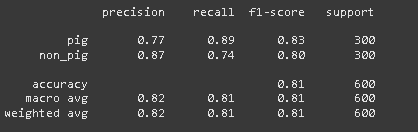
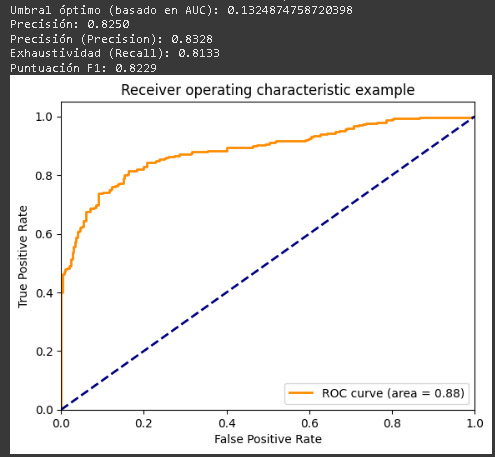
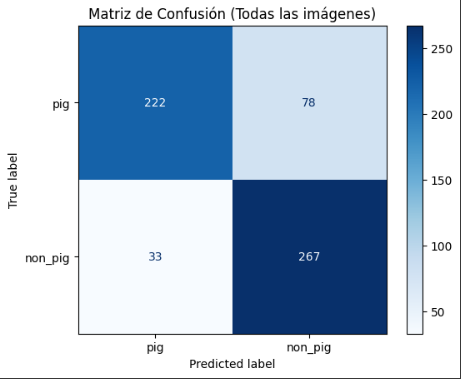
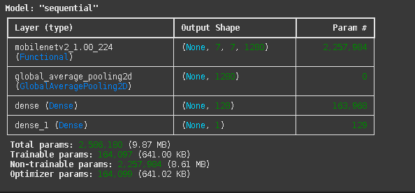
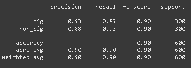
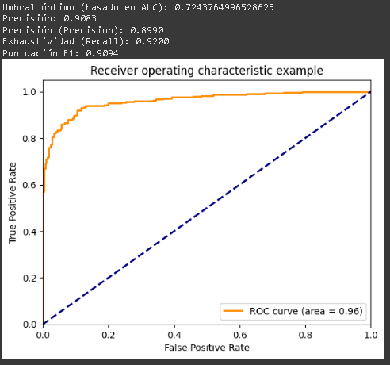
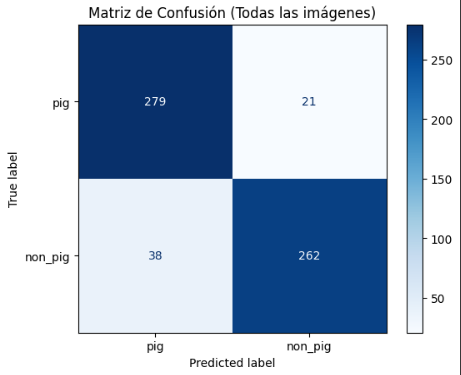
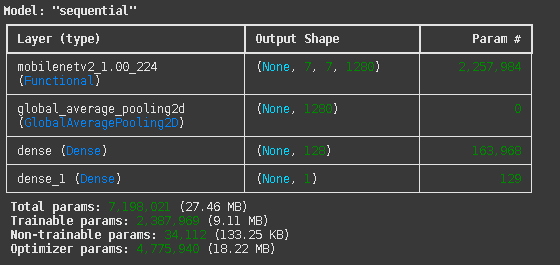
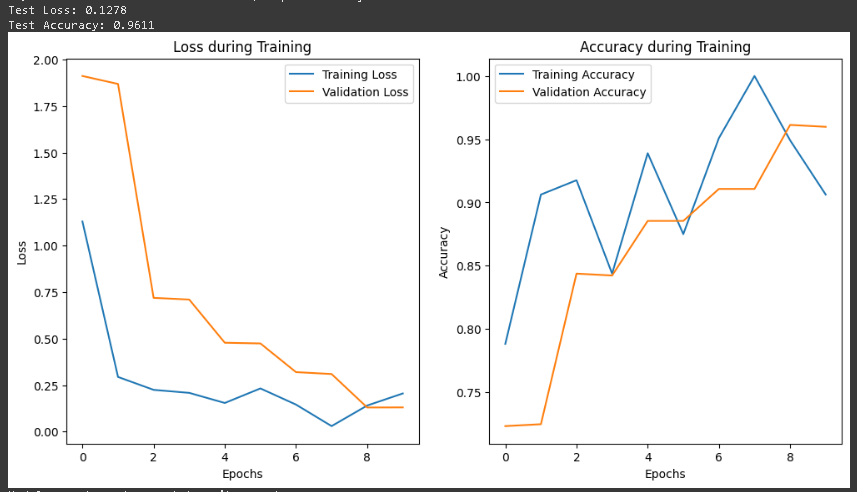

#  Clasificación de Cerdos - Modelo Base (v2)

## Introducción
Este proyecto tiene como objetivo entrenar y evaluar un modelo de clasificación binaria capaz de distinguir entre imágenes que contienen cerdos (`pig`) y las que no (`non_pig`). Se trabajó con la arquitectura **MobileNetV2**, utilizando **entrenamiento desde cero** en un modelo base (V2) y posteriormente **fine-tuning** en una nueva versión (V5).

---

## Dataset Utilizado

### Dataset de Entrenamiento (Modelo-Base-(V2))
- **Train**:
  - 3099 imágenes de `pig`
  - 3099 imágenes de `non_pig`
- **Test**:
  - 634 imágenes de `pig`
  - 634 imágenes de `non_pig`

### Dataset de Entrenamiento (Fine-Tuning (V5))
- **Train**:
  - 1,187 imágenes de `pig`
  - 1,187 imágenes de `non_pig`
- **Test**:
  - 347 imágenes de `pig`
  - 347 imágenes de `non_pig`

### Dataset de Validación
- Carpeta `/validation/` con 600 imágenes en total:
  - 300 imágenes etiquetadas como `pig`
  - 300 imágenes etiquetadas como `non_pig`

> ⚠️ **Nota**: Se detectaron algunas imágenes mal etiquetadas dentro de `validation/`. Esto será corregido en futuras etapas junto con el análisis Grad-CAM. Este dataset se utilizó únicamente para evaluación final, sin formar parte del entrenamiento.
               
---

## Configuración del Entorno

- Plataforma: Google Colab
- Framework: TensorFlow / Keras
- Formato de modelo guardado: `.keras` (se realizó también una copia en `.h5`)

---

## Proceso de Entrenamiento

## 🔧 Modelo Base (V2)

### Configuración del Modelo
- **Arquitectura**: MobileNetV2 (`weights=imagenet`, `include_top=False`)
- **Capas añadidas**:
  - `GlobalAveragePooling2D`
  - `Dense(128, activation='relu')`
  - `Dense(1, activation='sigmoid')`
- **Entrenamiento**:
  - Capas base congeladas
  - Épocas: 10
  - Batch Size: 32
  - Optimización: Adam (default params)
  - Pérdida: `binary_crossentropy`
  - Métrica: `accuracy`

### Resultados del Modelo Base
- **Accuracy**: 82.5%
- **Precision**: 83.28%
- **Recall**: 81.33%
- **F1-Score**: 82.29%
- **AUC-ROC**: 0.88

Visualizaciones:

| Datos Generales | Resultados Generales |
|------------------|----------------------|
|  |  |

| Matriz de Confusión | Arquitectura del Modelo |
|----------------------|-------------------------|
|  |  |

---

## Análisis de Resultados

- El modelo mostró un rendimiento sólido en la clasificación general.
- Se identificaron imágenes de **baja confianza** (outputs cercanos al umbral óptimo) que fueron analizadas.
- La arquitectura MobileNetV2 congelada permitió un entrenamiento rápido y estable para este primer acercamiento.
- Se detectó un pequeño margen de error en imágenes de la clase "no cerdo" (mayor cantidad de falsos positivos).
  
---

## Versión Mejorada (V5 - Fine-Tuning (V2))

### Configuración del Modelo
- **Método**: Fine-tuning parcial (capas superiores descongeladas)
- **Modelo base**: MobileNetV2 preentrenado en ImageNet
- **Entrenamiento**:
  - Nuevo dataset ampliado
  - Capas entrenables ajustadas
  - Data augmentation aplicado automáticamente

### Resultados del Fine-Tuning
- **Accuracy**: 83%
- **Precision**: 89.9%
- **Recall**: 92.0%
- **F1-Score**: 90.9%
- **AUC-ROC**: 0.96

Visualizaciones:

| Datos Generales | Resultados Generales |
|------------------|----------------------|
|  |  |

| Matriz de Confusión | Arquitectura del Modelo |
|----------------------|-------------------------|
|  |  |

📉 Izquierda: evolución de la pérdida (loss)  
📈 Derecha: evolución de la exactitud (accuracy) durante entrenamiento y validación.

---

## Comparación entre Versiones

| Métrica     | V2 (Modelo Base) | V5 (Fine-Tuned) |
|-------------|------------------|-----------------|
| Accuracy    | 82.5%            | 83%             |
| Precision   | 83.28%           | 89.9%           |
| Recall      | 81.33%           | 92%             |
| F1-Score    | 82.29%           | 90.9%           |
| AUC-ROC     | 0.88             | 0.96            |

 **Conclusión**:  
El fine-tuning mejoró claramente el rendimiento general del modelo, especialmente en el equilibrio entre precisión y recall. Se observa una mejora importante en la detección de `non_pig`, reduciendo el sobreajuste que presentaba la versión base.

---

---

## Scripts del Proyecto

- [Entrenamiento modelo base v2](scripts/Modelo_base/EntrenamientoDelModelo.ipynb)
- [Evaluación del modelo base v2](scripts/Modelo_base/VerificaciónDeModelos.ipynb)
- [Entrenamiento modelo fine-tuned v5](scripts/V.5/Fine-Tunnig.ipynb)
- [Evaluación del modelo fine-tuned v5](scripts/V.5/Pruebas_V_5.ipynb)
---

## Modelos entrenados

- [Modelo base entrenado](models)

- Modelo Fine-Tuning (V.5)

⚠️ Debido a restricciones de tamaño en GitHub, el modelo no se incluye en este repositorio. 

  Podés descargarlo desde aquí: 
- [Descargar modelo fine-tuned (.keras) - Google Drive](https://drive.google.com/file/d/1yj5wmjg_3p04Ek6Zmm01SDZgCWggg7eO/view?usp=sharing)

---

## Pendientes y Futuras Mejoras

- [ ] Corrección de etiquetas erróneas en `validation/`
- [ ] Aplicar Grad-CAM para interpretar mejor los errores
- [ ] Evaluar nueva versión V6 con ajustes en balance de clases y capas
- [ ] Agregar nuevos datasets de prueba no vistos
- [ ] Integrar modelo a la app móvil

---

## ¿Cómo correrlo?
1. Abrí el notebook en Google Colab
2. Subí el modelo (`.keras`)
3. Asegurate de tener cargado el dataset /validation con las imágenes.
4. Ejecutá las celdas en orden y observá los resultados.

 Nota: Si querés probar tu propio dataset, colocá las imágenes en una carpeta con subdirectorios pig/ y non_pig/ (como está estructurado /validation/).

---
## Autor

**Ariel Vilche**  
Estudiante de 2° año - Tecnicatura Universitaria en Desarrollo de Aplicaciones Móviles  
Proyecto personal con fines de aprendizaje y portfolio.

---

